<h3 align="center">
    <samp>
        <a href="https://git.io/typing-svg">
            
        </a>
    </samp>
</h3>

<hr>

<div align="center">
  
</div>

<hr>

<div align="center">

| Competition | Idea | Link |
|:-----------:|:----:|:----:|
| **AWSBuild 10,000 AIdeas** | MaatriSahayak | [Link](https://maatrisahayak.in/) |
| **Imagine Cup 2026 by Microsoft** | OptiMSP PaaS | [Link](https://github.com/Krishna-Tripathi78/OPTI-MSP-AI-AGENT) |

</div>

<hr>

<p align="center">
    <a href="https://www.linkedin.com/in/rishi-tiwari023/"></a>
    <a href="mailto:rishitiwari023.dev@gmail.com"></a>
</p>

<hr>

```js
About Me = {
"I find joy in crafting elegant solutions through the art of coding.",
"Proficient in languages like Python and C++, I navigate the digital realm with expertise.",
"My expertise extends to the intricate web technologies of NextJS, Node.js, and DevOps, where I blend creativity and functionality seamlessly.",
"I am more than a student; A creator, a problem solver, and a Developer.",
"Together, let's push the boundaries of what's possible and shape a future powered by code. ✨"
}
```

<hr>

<div align="center">
    <h1>Skill Set &nbsp;  </h1>
    <h4>Crafting scalable solutions with a modern tech stack that bridges innovation and performance.</h4>
</div>

<div align="center">
  <table>
      <tr>
        <td align="center" width="96">
          <br>C++
        </td>
        <td align="center" width="96">
          <br>C
        </td>
        <td align="center" width="96">
          <br>Java
        </td>
        <td align="center" width="96">
          <br>Python
        </td>
        <td align="center" width="96">
          <br>JavaScript
        </td>
        <td align="center" width="96">
          <br>TypeScript
        </td>
        <td align="center" width="96">
          <br>HTML
        </td>
        <td align="center" width="96">
          <br>CSS
        </td>
      </tr>
      <tr>
        <td align="center" width="96">
          <br>React
        </td>
        <td align="center" width="96">
          <br>Redux
        </td>
        <td align="center" width="96">
          <br>Tailwind
        </td>
        <td align="center" width="96">
          <br>Bootstrap
        </td>
        <td align="center" width="96">
          <br>MySQL
        </td>
        <td align="center" width="96">
          <br>MongoDB
        </td>
        <td align="center" width="96">
          <br>PostgreSQL
        </td>
        <td align="center" width="96">
          <br>Redis
        </td>
      </tr>
      <tr>
        <td align="center" width="96">
          <br>Node.js
        </td>
        <td align="center" width="96">
          <br>Express.js
        </td>
        <td align="center" width="96">
          <br>FastAPI
        </td>
        <td align="center" width="96">
          <br>REST
        </td>
        <td align="center" width="96">
          <br>Socket.io
        </td>
        <td align="center" width="96">
          <br>Cloudinary
        </td>
        <td align="center" width="96">
          <br>Swagger
        </td>
        <td align="center" width="96">
          <br>AWS
        </td>
      </tr>
      <tr>
        <td align="center" width="96">
          <br>Docker
        </td>
        <td align="center" width="96">
          <br>Kubernetes
        </td>
        <td align="center" width="96">
          <br>Nginx
        </td>
        <td align="center" width="96">
          <br>Grafana
        </td>
        <td align="center" width="96">
          <br>Jenkins
        </td>
        <td align="center" width="96">
          <br>Prometheus
        </td>
        <td align="center" width="96">
          <br>Razorpay
        </td>
        <td align="center" width="96">
          <br>Git
        </td>
      </tr>
      <tr>
        <td align="center" width="96">
          <br>GitHub
        </td>
        <td align="center" width="96">
          <br>VS Code
        </td>
        <td align="center" width="96">
          <br>ESLint
        </td>
        <td align="center" width="96">
          <br>Supabase
        </td>
        <td align="center" width="96">
          <br>DynamoDB
        </td>
        <td align="center" width="96">
          <br>WebRTC
        </td>
        <td align="center" width="96">
          <br>Firebase
        </td>
        <td align="center" width="96">
          <br>APIs
        </td>
      </tr>
  </table>
</div>
</div>

<hr>

<br>

<hr>

<div align="center">
  <h3>LeetCode Stats</h3>
  
</div>

<hr>

<div align="center">
  <h2> GitHub Stats</h2>
  
  <br><br>
  
</div>

<hr>

<div align="center">
  <h2> GitHub Metrics</h2>

 | Overview | Follow up Issues & PRs |
 |:--------:|:-------------------------:|
 |  |  |
 | Leetcode Stats | Notable Contributions |
 |  |  |
 | Achievements | Language Activity |
 |  |  |
 | Discussions | Reactions |
 |  |  |

</div>

<hr>

<div align="center">
  
  <br>
</div>

<hr>


<div align="center">
  
</div>
